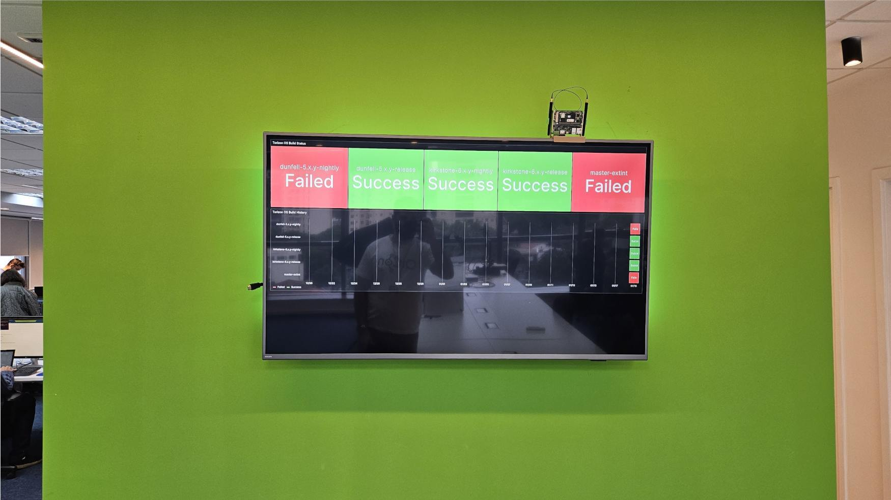
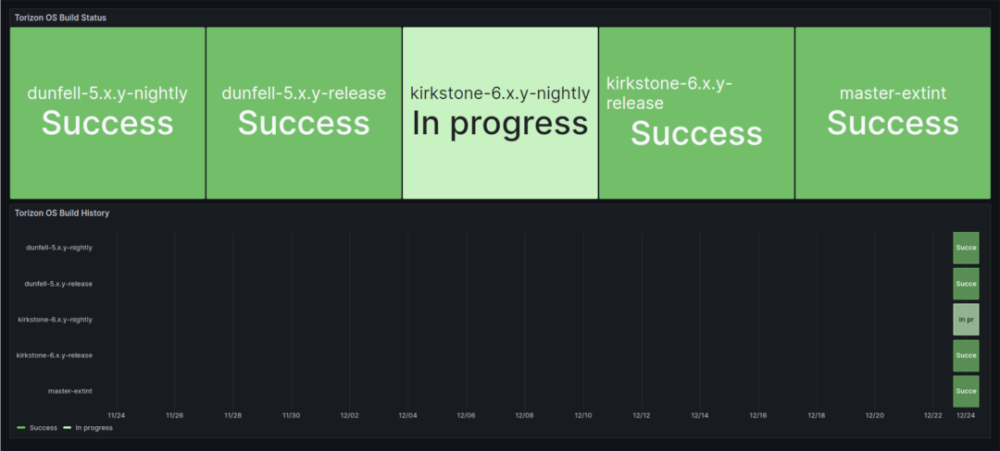

# Torizon OS Build Status #

This project collects data from the Torizon OS build pipelines and displays
it in a dashboard in kiosk mode.

## How to Use ##

Install the [docker-compose.prod.yml](./docker-compose.prod.yml) on a board
running Torizon OS and run it.

## Development ##

This is a multi-container project setup as a VS Code workspace. It is highly
recommended that you use VS Code and install the Torizon extension.

💡 for debugging the data gathering (Jenkins --> InfluxDB --> Grafana), use
the project
[dataAcquisition](./dataAcquisition).
