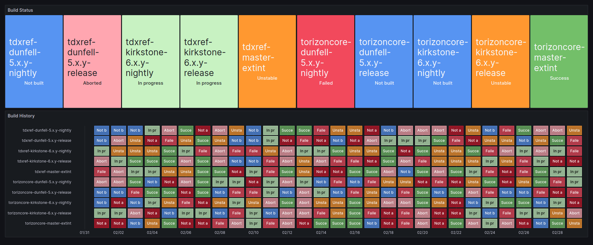

# Toradex OS Build Status #

This project collects data from the Toradex OS build pipelines and displays
it in a dashboard in kiosk mode.

## Usage ##

Install the [docker-compose.prod.yml](./docker-compose.prod.yml) on a board
running Torizon OS and run it.

## Development ##

This is a multi-container project setup as a VS Code workspace. It is highly
recommended that you use VS Code and install the Torizon IDE extension.

### Setup ###

- Install the [Torizon IDE Extension](https://marketplace.visualstudio.com/items?itemName=Toradex.apollox-vscode).
- Clone this project in a local directory.
- On VS Code, open this project with the option `Open workspace from file...`.
- Say `Yes` when VS Code start to ask you to check dependencies for the sub-projecs.

### Debug ###

💡 for debugging the data gathering (Jenkins --> InfluxDB --> Grafana), use
the sub-project `dataAcquisition`. Read the [dataAcquisition README](./dataAcquisition/.doc/README.md) for details.

For debugging the GH Actions pipelines, it is recommended to use [act](https://nektosact.com/).
